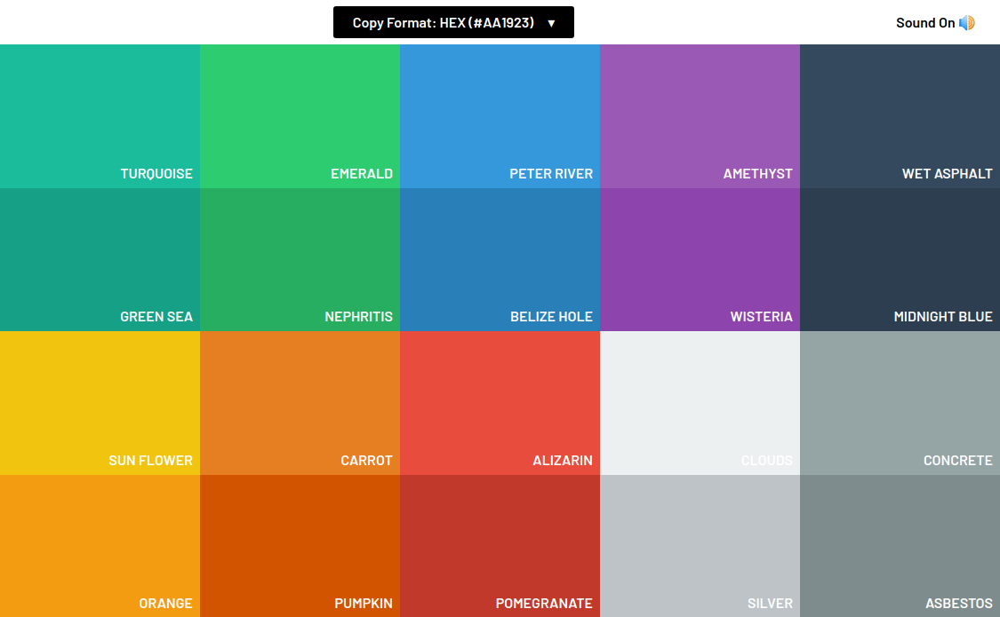

<p align="center">

  <h3 align="center">Flat UI Colors Clone</h3>

  <p align="center">
    This application is the clone of <a href="https://flatuicolors.com/palette/defo">Flat UI Colors</a>.
    <br />
    <a href="https://github.com/minhajul-karim/flatuicolors-clone"><strong>Explore the docs »</strong></a>
    <br />
    <a href="https://flat-ui-colors-clone.netlify.app/">View Demo</a>
    ·
    <a href="https://github.com/minhajul-karim/flatuicolors-clone/issues">Report Bug</a>
    ·
    <a href="https://github.com/minhajul-karim/flatuicolors-clone/issues">Request Feature</a>
  </p>
</p>

<!-- TABLE OF CONTENTS -->
<details open="open">
  <summary><h2 style="display: inline-block">Table of Contents</h2></summary>
  <ol>
    <li>
      <a href="#about-the-project">About The Project</a>
      <ul>
        <li><a href="#built-with">Built With</a></li>
      </ul>
    </li>
    <li>
      <a href="#getting-started">Getting Started</a>
      <ul>
        <li><a href="#prerequisites">Prerequisites</a></li>
        <li><a href="#installation">Installation</a></li>
      </ul>
    </li>
    <li><a href="#usage">Usage</a></li>
    <li><a href="#roadmap">Roadmap</a></li>
    <li><a href="#contributing">Contributing</a></li>
    <li><a href="#contact">Contact</a></li>
    <li><a href="#acknowledgements">Acknowledgements</a></li>
  </ol>
</details>

<!-- ABOUT THE PROJECT -->

## About The Project

<p align="center">
  <a href="https://flat-ui-colors-clone.netlify.app/">
    
  </a>
</p>

### Built With

- [JavaScript](https://developer.mozilla.org/en-US/docs/Web/JavaScript)
- [React](https://reactjs.org/)
- [Sass](https://sass-lang.com/)

<!-- GETTING STARTED -->

## Getting Started

To get a local copy up and running, follow these simple steps.

### Prerequisites

- npm
  ```sh
  npm install npm@latest -g
  ```
  or
  ```sh
  npm install --global yarn
  ```

### Installation

1. Clone the repo
   ```sh
   git clone https://github.com/minhajul-karim/flatuicolors-clone.git
   ```
2. Install NPM packages
   ```sh
   npm install
   ```
   or
   ```sh
   yarn install
   ```
3. Start the development server

   ```sh
   npm start
   ```

   or

   ```sh
   yarn start
   ```

<!-- USAGE EXAMPLES -->

## Usage

**Select color format**: There is a dropdown menu on the top of the application that lets you select your desired color format. Currently, this application supports `HEX(#AA1923)`, `HEX(AA1923)`, `RGB-(1, 2, 3)`, `RGBA-(1, 2, 3, 0.4)`.

**Copy color code**: Click on your desired grid cell to copy the color code.

**Sound**: Sound can be enabled/disabled by clicking the button on the top right.

<!-- ROADMAP -->

## Roadmap

See the [open issues](https://github.com/minhajul-karim/flatuicolors-clone/issues) for a list of proposed features (and known issues).

<!-- CONTRIBUTING -->

## Contributing

To contribute:

1. Fork the Project
2. Create your Feature Branch (`git checkout -b feature/AmazingFeature`)
3. Commit your Changes (`git commit -m 'Add some AmazingFeature'`)
4. Push to the Branch (`git push origin feature/AmazingFeature`)
5. Open a Pull Request

<!-- CONTACT -->

## Contact

Minhajul Karim - [@minhajul93](https://twitter.com/minhajul93) - minhajul.kaarim@gmail.com

Project Link: [https://github.com/minhajul-karim/flatuicolors-clone](https://github.com/minhajul-karim/flatuicolors-clone)

<!-- ACKNOWLEDGEMENTS -->

## Acknowledgements

- [Flat UI Colors 2](https://flatuicolors.com/)
- [Ahmet Sülek](https://twitter.com/ahmetsulek)
